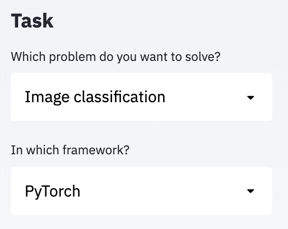

<h1 align="center">
    Traingenerator
</h1>

<p align="center">
    <strong>🧙&nbsp; A web app to generate template code for machine learning ✨</strong>
</p>

<p align="center">
    <!-- <a href="https://twitter.com/jrieke"></a> -->
    <a href="https://gitter.im/jrieke/traingenerator"></a>
    <a href="https://traingenerator.jrieke.com/"></a>
    <!-- <a href="https://www.buymeacoffee.com/jrieke"></a> -->
    <!-- <a href="LICENSE"></a> -->
    <a href="https://github.com/psf/black"></a>
</p>

<br>

<p align="center">
    
</p>

<br>

<h3 align="center">
    🎉 Traingenerator is now live! 🎉
    <br><br>
    Try it out: <br>
    <a href="https://traingenerator.jrieke.com">https://traingenerator.jrieke.com</a>
</h3>

<!--
<p align="center"><strong>
    Try it out: <br>
    >>> <a href="https://traingenerator.jrieke.com">https://traingenerator.jrieke.com</a> <<<</strong>
</p>
-->

<br>

Generate custom template code for PyTorch & sklearn, using a simple web UI built with [streamlit](https://www.streamlit.io/). Traingenerator offers multiple options for preprocessing, model setup, training, and visualization (using Tensorboard or comet.ml). It exports to .py, Jupyter Notebook, or  [Google Colab](https://colab.research.google.com/). The perfect tool to jumpstart your next machine learning project!

<br>

*For updates, [follow me on Twitter](https://twitter.com/jrieke), and if you like this project, please [consider sponsoring](https://github.com/sponsors/jrieke) ☺*

<br>

---

<br>

## Adding new templates

You can add your own template in 4 easy steps (see below), without changing any code 
in the app itself. Your new template will be automatically discovered by Traingenerator 
and shown in the sidebar. That's it! 🎈

**Want to share your magic?** 🧙 PRs are welcome! Please have a look 
at [CONTRIBUTING.md](CONTRIBUTING.md) and write on [Gitter](https://gitter.im/jrieke/traingenerator). 

**Some ideas for new templates:** Keras/Tensorflow, Pytorch Lightning, object detection, 
segmentation, text classification, ...



1. **Create a folder under `./templates`.** 
The folder name should be the task that your template solves (e.g. 
`Image classification`). Optionally, you can add a framework name (e.g. 
`Image classification_PyTorch`). Both names are automatically shown in the first two 
dropdowns in the sidebar (see image). 
✨ *Tip: Copy the [example template](templates/example) to get started more quickly.* 
1. **Add a file `sidebar.py` to the folder ([see example](templates/example/sidebar.py)).** 
It needs to contain a method `show()`, which displays all template-specific streamlit 
components in the sidebar (i.e. everything below *Task*) and returns a dictionary of 
user inputs.
3. **Add a file `code-template.py.jinja` to the folder ([see example](templates/example/code-template.py.jinja)).** 
This [Jinja2 template](https://jinja.palletsprojects.com/en/2.11.x/templates/) is used 
to generate the code. You can write normal Python code in it and modify it 
(through Jinja) based on the user inputs in the sidebar (e.g. insert a parameter 
value from the sidebar or show different code parts based on the user's selection). 
4. **Optional: Add a file `test-inputs.yml` to the folder ([see example](templates/example/test-inputs.yml)).** 
This simple YAML file should define a few possible user inputs that can be used for 
testing. If you run pytest (see below), it will automatically pick up this file, render 
the code template with its values, and check that the generated code runs without 
errors. This file is optional – but it's required if you want to contribute your 
template to this repo. 


## Installation

**Note: You only need to install Traingenerator if you want to contribute or run it 
locally. If you just want to use it, go [here](https://traingenerator.jrieke.com).**

```bash
git clone https://github.com/jrieke/traingenerator.git
cd traingenerator
pip install -r requirements.txt
```

*Optional: For the "Open in Colab" button to work you need to set up a Github repo 
where the notebook files can be stored (Colab can only open public files if 
they are on Github). After setting up the repo, create a file `.env` with content:*

```bash
GITHUB_TOKEN=<your-github-access-token>
REPO_NAME=<user/notebooks-repo>
```

*If you don't set this up, the app will still work but the "Open in Colab" button 
will only show an error message.*


## Running locally

```bash
streamlit run app/main.py
```

Make sure to run always from the `traingenerator` dir (not from the `app` dir), 
otherwise the app will not be able to find the templates.

## Deploying to Heroku

First, [install heroku and login](https://devcenter.heroku.com/articles/getting-started-with-python#set-up). 
To create a new deployment, run inside `traingenerator`:

```
heroku create
git push heroku main
heroku open
```

To update the deployed app, commit your changes and run:

```
git push heroku main
```

*Optional: If you set up a Github repo to enable the "Open in Colab" button (see above),
you also need to run:*

```
heroku config:set GITHUB_TOKEN=<your-github-access-token>
heroku config:set REPO_NAME=<user/notebooks-repo>
```

## Testing

First, install pytest and required plugins via:

```bash
pip install -r requirements-dev.txt
```

To run all tests: 

```bash
pytest ./tests
```

Note that this only tests the code templates (i.e. it renders them with different 
input values and makes sure that the code executes without error). The streamlit app 
itself is not tested at the moment.

You can also test an individual template by passing the name of the template dir to 
`--template`, e.g.:

```bash
pytest ./tests --template "Image classification_scikit-learn"
```

---

The mage image used in Traingenerator is from 
[Twitter's Twemoji library](https://github.com/twitter/twemoji) and 
released under Creative Commons Attribution 4.0 International Public License.